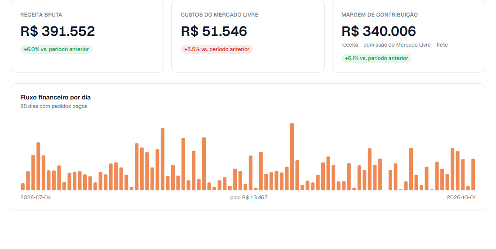
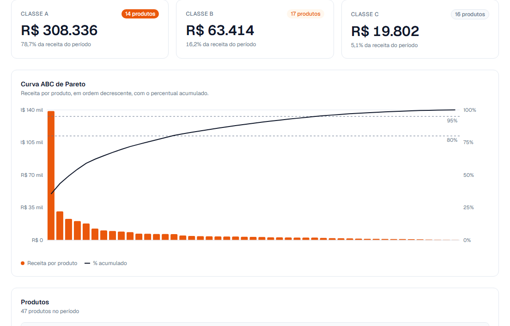
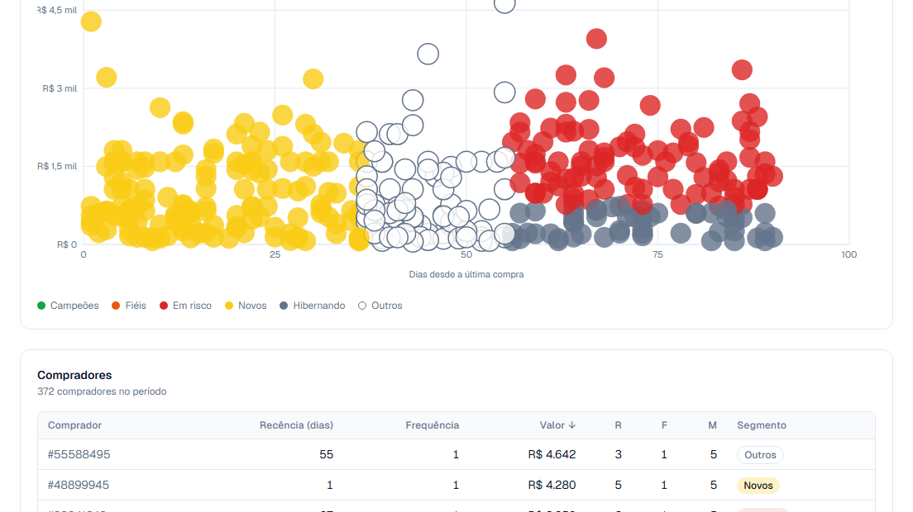

# SellerPulse

> **Analytics para vendedores do Mercado Livre — do pedido bruto à decisão de negócio.**

O vendedor conecta a conta dele pelo fluxo oficial do Mercado Livre, os últimos 6 meses de pedidos entram sozinhos, e três telas respondem o que a plataforma não responde: **quanto sobra de cada venda, quais produtos sustentam a loja, e quem são os compradores que valem a pena reconquistar.**

Sem planilha, sem CSV, sem campo digitado à mão.

[](https://github.com/carrerigcg/sellerpulse/actions/workflows/tests.yml)


**[→ Demonstração navegável, sem cadastro](https://frontend-three-rosy-iwes33l1kk.vercel.app/demo)**


---

## As três telas

Os prints abaixo são capturas da demonstração pública. Os dados dela são sintéticos e **se regeneram periodicamente para terminar sempre no dia de hoje**, então os valores exatos mudam com o tempo — a forma, o volume e o catálogo são os mesmos.

### Financeiro — quanto sobra de cada venda



Receita, comissão do Mercado Livre e **margem de contribuição** por dia, com variação sobre o período anterior.

A margem é **calculada, não estimada**: `receita − comissão − frete`, cada parcela rastreável a uma coluna do banco. O custo do produto é o único número que o sistema não tem — e ele diz isso na tela, em vez de preencher com um percentual chutado.

### Produtos — o que sustenta a loja



Curva ABC de Pareto sobre a receita por produto. Na demonstração, **14 produtos respondem por 78,7% do faturamento** e a cauda de 16 produtos responde por 5,1%.

Tem também cohort por mês de lançamento, para ver se produto novo vinga ou morre.

### Clientes — quem volta e quem está sumindo



Segmentação RFM (recência, frequência, valor). Cada ponto é um comprador, colorido pelo segmento; o eixo X é dias desde a última compra, então quem está indo embora aparece à direita.

É o que transforma *"tive 372 compradores"* em *"95 deles estão sumindo e valem R$ 154 mil"*.

---

## Como funciona

```
Conta do Mercado Livre
        │  OAuth 2.0 oficial — a senha do vendedor nunca passa pelo SellerPulse
        ▼
  Fila de sincronização  ──►  6 meses de pedidos, em janelas de 30 dias
        │                      retoma de onde parou se a instância cair
        ▼
     PostgreSQL           ──►  multi-inquilino, isolado por seller_id
        │
        ▼
   API (FastAPI)          ──►  métricas e segmentação em pandas
        │
        ▼
    Web (Next.js)
```

**Decisões que valem citar:**

- **Multi-inquilino desde a primeira migration.** Toda tabela usa chave composta por `seller_id`, toda consulta filtra por ele, e **todo JOIN casa por `seller_id` também** — sem isso um `item_id` do Mercado Livre, que é global, casaria com o pedido de outro vendedor e multiplicaria a receita. Há RLS no banco, mas como defesa em profundidade: o backend conecta num papel que a contorna, então quem garante o isolamento é o predicado explícito na consulta, coberto por teste de mutação.
- **Tokens cifrados em repouso** (Fernet, com versão de chave). O Mercado Livre rotaciona o *refresh token* a cada uso, então a renovação é serializada por lock de linha — dois refreshes simultâneos invalidariam um ao outro.
- **A fila sobrevive à hibernação.** O plano gratuito do Render derruba a instância depois de ~15 min; o job tem *lease* com renovação e cursor de retomada, então uma importação interrompida continua em vez de recomeçar.
- **Sincronização incremental que revisita o passado.** O delta filtra por `date_last_updated`, não por data de criação — um pedido cancelado semanas depois precisa deixar de contar como receita.
- **A porta pública é só leitura.** `/demo/*` é o único caminho sem autenticação: aceita apenas GET, resolve o vendedor por variável de ambiente do servidor (nunca por parâmetro), exige a marca `is_demo` no banco, e tem teto de janela e de paginação.

---

## Stack

| Camada | |
|---|---|
| **Backend** | Python 3.11 · FastAPI · asyncpg · pandas |
| **Banco** | PostgreSQL 17 (Supabase) · 8 migrations versionadas · chave composta por `seller_id` |
| **Frontend** | Next.js 16 · React 19 · TypeScript · Tailwind · Recharts |
| **Auth** | Supabase Auth (JWT ES256) + OAuth 2.0 do Mercado Livre |
| **Infra** | Render (Docker) · Vercel |
| **Testes** | pytest · 564 testes · CI em 4 jobs (Linux + Windows) |

---

## Rodando localmente

Pré-requisitos: Python 3.11+, Node 20+, PostgreSQL 17.

```bash
# 1. Backend  (no Windows troque bin/ por Scripts/)
python -m venv backend/.venv
backend/.venv/bin/pip install -r backend/requirements.txt
cp backend/.env.example backend/.env             # preencher as credenciais
backend/.venv/bin/python backend/scripts/setup_test_db.py

# 2. Frontend
cd frontend && npm ci && cp .env.local.example .env.local

# 3. Subir
backend/.venv/bin/python -m uvicorn backend.main:app --port 10000
cd frontend && npm run dev                       # web em :3000
```

Todo comando roda a partir da **raiz do repositório** — `backend/` não é instalado via pip, roda como pacote top-level igual a `src/`.

As migrations em `backend/migrations/` rodam em ordem numérica. A `0000` é um stub do schema `auth` para o banco de testes; no Supabase esse schema já existe.

---

## Testes

```bash
.venv/bin/python -m pytest tests                  # camada analítica pura (316)
backend/.venv/bin/python -m pytest backend/tests  # API, fila, ingestão (248)
cd frontend && npm run lint && npm run build
```

**Teste de mutação é padrão do projeto, não exceção.** Toda correção quebra o código de propósito primeiro, confirma que o teste falha, e só então desfaz. A razão é concreta: um erro que zerava a comissão do Mercado Livre sobreviveu meses porque os dados de teste tinham exatamente as mesmas premissas erradas do código — os testes provavam que o sistema concordava consigo mesmo, não que estava certo.

Desde então a regra é verificar contra dado real, não só contra fixture.

---

## Estrutura

```
sellerpulse/
├── backend/
│   ├── analytics/        # métricas e segmentação sobre Postgres (asyncpg)
│   ├── ml/               # OAuth, cifra de tokens, ingestão da API do ML
│   ├── jobs/ worker/     # fila de sincronização com lease e retomada
│   ├── routers/          # endpoints REST (autenticados + /demo público)
│   ├── migrations/       # 8 migrations SQL versionadas
│   └── tests/            # 248 testes
├── frontend/
│   ├── app/              # landing, /demo público, /dashboard autenticado
│   ├── components/       # gráficos, tabelas, seções da landing
│   └── lib/              # clientes da API (um por contexto de auth)
├── src/                  # camada analítica original (SQLite) — alimenta o PDF
├── tests/                # 316 testes da camada pura
├── templates/            # template Jinja2 do relatório em PDF
└── docs/specs/           # design docs de cada sprint
```

> `src/` é a camada da primeira versão, single-tenant sobre SQLite. Ela continua viva porque o gerador de relatório em PDF depende dela, e `backend/analytics/` é um porte fiel dela para Postgres — as divergências deliberadas entre as duas estão documentadas em comentário, no ponto exato em que divergem.

---

## Status

| | |
|---|---|
| Conexão com conta real do Mercado Livre | ✅ em produção |
| Importação de 6 meses + sincronização incremental | ✅ em produção |
| Três telas, autenticadas e públicas | ✅ em produção |
| Demonstração sem cadastro | ✅ [no ar](https://frontend-three-rosy-iwes33l1kk.vercel.app/demo) |
| Custo do produto informado pelo vendedor | 📋 planejado |
| Custo de frete via API de shipments | 📋 planejado |
| Relatório em PDF sobre dados reais | 📋 planejado |

---

## Licença

[MIT](./LICENSE) — livre uso comercial e pessoal, com atribuição.

---

## Autor

**Guilherme Carreri** — analista de dados, aplicando para posições de estágio em BI / Data & Analytics.

[carreri.gui@gmail.com](mailto:carreri.gui@gmail.com)
